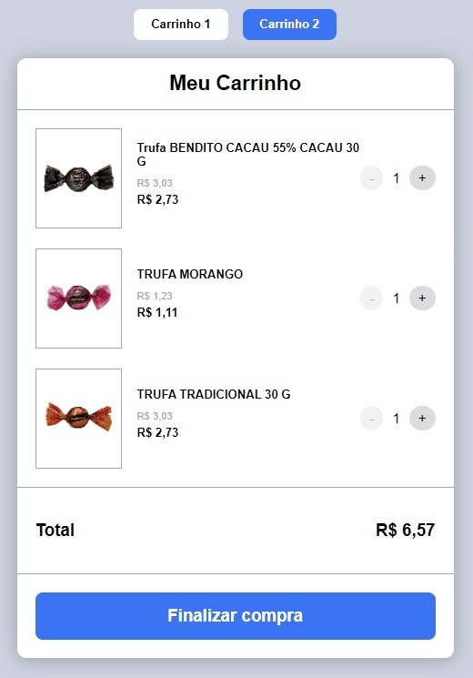

# Codeby Challenge

This project is a challenge proposed by Codeby. It was developed using clean code and mobile first.

<p align="center">
  
</p>

# Tecnologies

- [TypeScript](https://www.typescriptlang.org/)
- [ReactJS](https://reactjs.org/)
- [Styled Components](https://styled-components.com/)
- [Jest](https://jestjs.io/)
- [React Testing Library](https://testing-library.com/docs/react-testing-library/intro)
- [Eslint](https://eslint.org/)
- [Prettier](https://prettier.io/)
- [Husky](https://github.com/typicode/husky)

# Getting Started

## Requirements:

- NPM
- Node.js
  <br /><br />

Clone this repository:

```bash
git clone https://github.com/GabrielCastilhoV/codeby-challenge.git
```

Install dependencies:

```bash
yarn install
# or
npm install
```

Run the development server:

```bash
yarn dev
# or
npm run dev
```

Run tests:

```bash
yarn test
```

Open [http://localhost:3000](http://localhost:3000) with your browser to see the result.

## Commands

- `dev`: runs your application on `localhost:3000`
- `build`: creates the production build version
- `lint`: runs the linter in all components and pages
- `test`: runs jest to test all components and pages

<br />

By <a href="https://www.linkedin.com/in/gabrielcastilhov" target="_blank"> Gabriel Castilho 👋🏽 </a>. <br />
